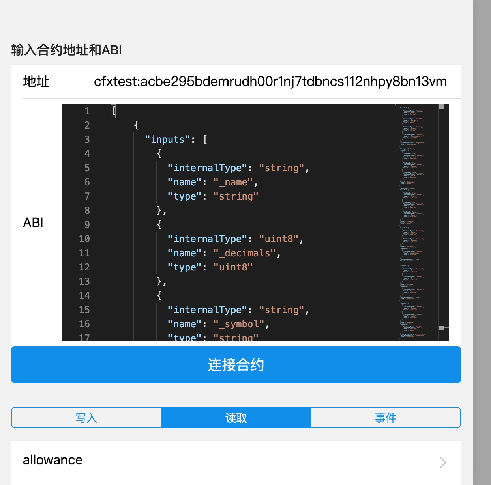

# conflux 前端示例

## Getting Started

Install dependencies,

```bash
$ yarn
```

Start the dev server,

```bash
$ yarn start
```

## screenshots

<p align="center">
  
</p>

## 示例地址
[https://yongjun925.github.io/conflux-frontend-demo/](https://yongjun925.github.io/conflux-frontend-demo/)

* 使用测试网络通过，正式网络使用最新的SDK会报地址验证失败问题，待解决
* 要先安装ConfluxPortal，不然打开会报错，这个待解决
